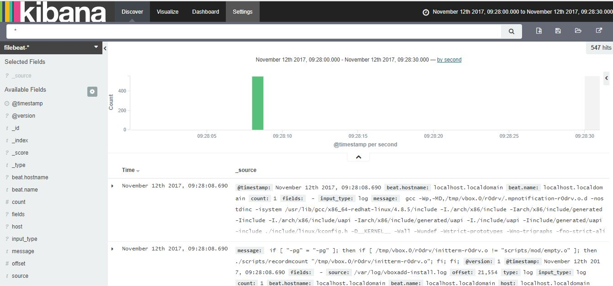

# Parcial 1 - Daniel Gutierrez A00320176

Repositorio: https://github.com/dgutierrez1/sd-exam1

## [PDF](https://github.com/dgutierrez1/sd-exam1/blob/A00320176/add-solution/Documento%20-%20Daniel%20Gutierrez%20A00320176.pdf)

El siguiente repositorio es creado para dar respuesta a:

*`
Deberá	realizar	el	aprovisionamiento	de	un	ambiente	compuesto	por	los	siguientes	elementos: Un servidor encargado de almacenar logs por medio de la aplicación Elasticsearch, un servidor encargado de hacer la conversión de logs por medio de la aplicación Logstash, un servidor con la herramienta encargada de visualizar la información de los logs por medio de la aplicación Kibana, por último uno o varios servidores web ejecutando la aplicación filebeat para el envío de los logs al servidor con Logstash*
`*


## Comandos de Linux necesarios para el aprovisionamiento de los servicios solicitados.

### Filebeat

Comando | Descripción
------------ | -------------
`sudo yum -y install filebeat` | Despues de que Chef copie el archivo `filebeat.repo` al directorio de los repositorios de `yum` se podra realizar la instalacion
`systemctl daemon-reload``systemctl enable filebeat``systemctl start filebeat``systemctl restart network` | Despues de pasar el archivo de configuracion `filebeat.yml`, se encargan de configurar e iniciar el servicio 


### Logstash

Comando | Descripción
------------ | -------------
`sudo yum install -y java-1.8.0-openjdk` `sudo yum -y install logstash` | Despues de que Chef copie el archivo `logstash.repo` al directorio de los repositorios de `yum` se podra realizar la instalacion
`systemctl start firewalld` `firewall-cmd --add-port=5044/tcp`` firewall-cmd --add-port=5044/tcp --permanent``systemctl restart network` `sudo service logstash start`| Despues de pasar el archivo de configuracion `logstash.yml`, se encargan de configurar e iniciar el servicio 


### Elasticsearch

Comando | Descripción
------------ | -------------
`sudo yum install -y java-1.8.0-openjdk` `    yum -y install elasticsearch` | Despues de que Chef copie el archivo `elasticsearch.repo` al directorio de los repositorios de `yum` se podra realizar la instalacion
`systemctl start firewalld` `firewall-cmd --add-port=9200/tcp`` firewall-cmd --add-port=9200/tcp --permanent``systemctl restart network`| Despues de pasar el archivo de configuracion `elasticsearch.yml`, se encargan de configurar el servicio
`curl -O https://gist.githubusercontent.com/thisismitch/3429023e8438cc25b86c/raw/d8c479e2a1adcea8b1fe86570e42abab0f10f364/filebeat-index-template.json && curl -XPUT 'http://192.168.56.104:9200/_template/filebeat?pretty' -d@filebeat-index-template.json`` sudo service elasticsearch start`| Se encargan de pasar el template del index de filebeat a elasticsearch e iniciar el servicio


### Kibana

Comando | Descripción
------------ | -------------
`sudo yum install -y java-1.8.0-openjdk` `sudo yum -y install kibana` | Despues de que Chef copie el archivo `kibana.repo` al directorio de los repositorios de `yum` se podra realizar la instalacion
`systemctl start firewalld` `firewall-cmd --add-port=5601/tcp`` firewall-cmd --add-port=5601/tcp --permanent``systemctl restart network` `sudo systemctl enable kibana``sudo systemctl start kibana`| Despues de pasar el archivo de configuracion `kibana.yml`, se encargan de configurar e iniciar el servicio 


## Vagrantfile con el aprovisionamiento de las maquinas
```ruby

Vagrant.configure("2") do |config|
  
  # FILEBEAT
  config.vm.define :filebeat_server do |filebeat|
    filebeat.vm.box = "Centos1704v2"
    filebeat.vm.network :private_network, ip: "192.168.56.102"
    filebeat.vm.provider :virtualbox do |vb|
      vb.customize ["modifyvm", :id, "--memory", "512","--cpus", "1", "--name", "filebeat_server" ]
    end
    config.vm.provision :chef_solo do |chef|
      chef.cookbooks_path = "cookbooks"
      chef.add_recipe "filebeat"
    end
  end

  # LOGSTASH
  config.vm.define :logstash_server do |logstash|
    logstash.vm.box = "Centos1704v2"
    logstash.vm.network :private_network, ip: "192.168.56.103"
    logstash.vm.provider :virtualbox do |vb|
      vb.customize ["modifyvm", :id, "--memory", "512","--cpus", "1", "--name", "logstash_server" ]
    end
    config.vm.provision :chef_solo do |chef|
      chef.cookbooks_path = "cookbooks"
      chef.add_recipe "logstash"
    end
  end

  # ELASTIC
  config.vm.define :elastic_server do |elastic|
    elastic.vm.box = "Centos1704v2"
    elastic.vm.network :private_network, ip: "192.168.56.104"
    elastic.vm.provider :virtualbox do |vb|
      vb.customize ["modifyvm", :id, "--memory", "1024","--cpus", "1", "--name", "elastic_server" ]
    end
    config.vm.provision :chef_solo do |chef|
      chef.cookbooks_path = "cookbooks"
      chef.add_recipe "elastic"
    end
  end
  
  # KIBANA
  config.vm.define :kibana_server do |kibana|
    kibana.vm.box = "Centos1704v2"
    kibana.vm.network :private_network, ip: "192.168.56.105"
    kibana.vm.provider :virtualbox do |vb|
      vb.customize ["modifyvm", :id, "--memory", "512","--cpus", "1", "--name", "kibana_server" ]
    end
    config.vm.provision :chef_solo do |chef|
      chef.cookbooks_path = "cookbooks"
      chef.add_recipe "kibana"
    end
  end

end
```


## Cookbooks necesarios


## Filebeat

### `filebeat_install`

```ruby
cookbook_file '/etc/yum.repos.d/filebeat.repo' do
    source 'filebeat.repo'
    mode 0644
end

bash 'install_filebeat' do
	code <<-EOH
    sudo yum -y install filebeat
	EOH
end
```

### `filebeat_files`

```ruby
cookbook_file '/etc/filebeat/filebeat.yml' do
    source 'filebeat.yml'
    mode 0644
end
```


### `filebeat_config`

```ruby
bash 'start_filebeat' do
    user 'root'
    code <<-EOH
    systemctl daemon-reload
    systemctl enable filebeat
    systemctl start filebeat
    systemctl restart network
    EOH
  end
```


## Logstash

### `logstash_install`

```ruby
cookbook_file '/etc/yum.repos.d/logstash.repo' do
    source 'logstash.repo'
    mode 0644
end


bash 'install_logstash' do
	code <<-EOH
    sudo yum install -y java-1.8.0-openjdk
    sudo yum -y install logstash
	EOH
end
```

### `logstash_files`

```ruby
cookbook_file '/etc/logstash/conf.d/logstash.conf' do
	source 'logstash.conf'
	mode 0644
	owner 'root'
	group 'wheel'
end
```


### `logstash_config`

```ruby
bash 'open_port' do
    user 'root'
    code <<-EOH
    systemctl start firewalld
    firewall-cmd --add-port=5044/tcp
    firewall-cmd --add-port=5044/tcp --permanent
    systemctl restart network
	EOH
end

bash 'start_logstash' do
	code <<-EOH
    sudo service logstash start
	EOH
end
```


## Elasticsearch

### `elastic_install`

```ruby
bash 'install_elastic1' do
	code <<-EOH
    sudo yum -y install java-1.8.0-openjdk
	EOH
end

cookbook_file '/etc/yum.repos.d/elasticsearch.repo' do
	source 'elasticsearch.repo'
	mode 0644
	owner 'root'
	group 'wheel'
end

bash 'install_elastic2' do
	code <<-EOH
    yum -y install elasticsearch
	EOH
end
```

### `elastic_files`

```ruby
cookbook_file '/etc/elasticsearch/elasticsearch.yml' do
	source 'elasticsearch.yml'
	mode 0644
	owner 'root'
	group 'wheel'
end
```


### `elastic_config`

```ruby
service "firewalld" do
	action [ :enable, :start]
end

bash 'open_port' do
    code <<-EOH
    sudo firewall-cmd --add-port=9200/tcp
    sudo firewall-cmd --add-port=9200/tcp --permanent
    sudo systemctl restart network
	EOH
end

bash 'start_elastic' do
    code <<-EOH
    curl -O https://gist.githubusercontent.com/thisismitch/3429023e8438cc25b86c/raw/d8c479e2a1adcea8b1fe86570e42abab0f10f364/filebeat-index-template.json && curl -XPUT 'http://192.168.56.104:9200/_template/filebeat?pretty' -d@filebeat-index-template.json
    sudo service elasticsearch start  
	EOH
end
```


## Kibana

### `kibana_install`

```ruby
bash 'install_kibana' do
    user 'root'
    code <<-EOH
    sudo yum makecache fast
    sudo yum -y install java
	EOH
end

cookbook_file '/etc/yum.repos.d/kibana.repo' do
	source 'kibana.repo'
	mode 0644
	owner 'root'
	group 'wheel'
end

bash 'install_kibana' do
    user 'root'
    code <<-EOH
    yum -y install kibana
	EOH
end
```

### `kibana_files`

```ruby
cookbook_file '/opt/kibana/config/kibana.yml' do
	source 'kibana.yml'
	mode 0644
	owner 'root'
	group 'wheel'
end

remote_directory '/home/vagrant/dashboards' do
	source 'dashboards'
	owner 'root'
	group 'root'
	mode '0755'
	action :create
 end
```


### `kibana_config`

```ruby
bash 'config_kibana1' do
    user 'root'
    code <<-EOH
    systemctl start firewalld
    firewall-cmd --add-port=5601/tcp
    firewall-cmd --add-port=5601/tcp --permanent
    systemctl restart network
    
    sudo yum install -y unzip
	EOH
end

#curl -L -O https://download.elastic.co/beats/dashboards/beats-dashboards-1.2.2.zip  | unzip | ./load.sh
# bash 'config_kibana2' do
#     user 'root'
#     code <<-EOH
#     ./beats-dashboards-*/load.sh
# 	EOH
# end
# bash 'setup_kibana_dashboards' do
#     user 'root'
#     code <<-EOH
#     sudo systemctl restart kibana        
#     sudo systemctl daemon-reload
#     . /home/vagrant/dashboards/load.sh
# 	EOH
# end

bash 'config_kibana3' do
    user 'root'
    code <<-EOH
    sudo systemctl restart kibana    
    sudo systemctl enable kibana
    sudo systemctl start kibana
    curl -O https://gist.githubusercontent.com/thisismitch/3429023e8438cc25b86c/raw/d8c479e2a1adcea8b1fe86570e42abab0f10f364/filebeat-index-template.json && curl -XPUT 'http://192.168.56.105:9200/_template/filebeat?pretty' -d@filebeat-index-template.json    
    sudo systemctl restart kibana
	EOH
end
```


## Prueba del funcionamiento




## Problemas encontrados y resueltos

Problema | Descripción |Solución
------------ | ------------- |  -------------
|Incompatibilidad de las versiones de Kibana y Elasticsearch | Al seguir una guia de instalacion de los servicios, se empezo instalando las ultimas versiones de Kibana y Elasticsearch. Esto cambio porque en la guia se especificaba muy poco a configuracion de Kibana, entonces toco instalar y configurar otra version de la cual si se tenia informacion mas completa. Esto genero conflictos, ya que, esa version de Kibana solo era compatible con una version anterior de Elasticsearch, ademas, se presentaron conflictos con los otros servicios. | Cambie como se estaban instalando todos los servicios para utilizar una version mas antigua. Ahora todos se instalan, primero copiando el archivo del repositorio a la maquina respectiva, y despues realizando la instalacion.
|  | | | 
